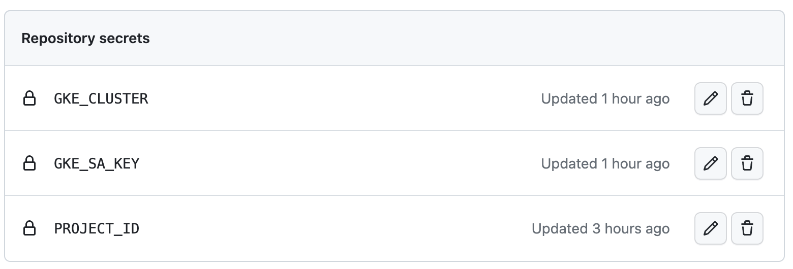

# Prerequisites
* Create a Service Account:
```
export PROJECT_ID=your-project-id
gcloud iam service-accounts create github-actions --display-name=github-actions
```

* Grant the Service Account the IAM roles that have least privilege access for publishing images to GCR and connecting to GKE:
```
gcloud projects add-iam-policy-binding ${PROJECT_ID} \
        --member=serviceAccount:github-actions@${PROJECT_ID}.iam.gserviceaccount.com \
        --role=roles/storage.admin
```
```
gcloud projects add-iam-policy-binding ${PROJECT_ID} \
        --member=serviceAccount:github-actions@${PROJECT_ID}.iam.gserviceaccount.com \
        --role=roles/container.clusterViewer
```
```
gcloud projects add-iam-policy-binding ${PROJECT_ID} \
        --member=serviceAccount:github-actions@${PROJECT_ID}.iam.gserviceaccount.com \
        --role=roles/container.admin
```

* Create the service account key:
```
gcloud iam service-accounts keys create /tmp/github-actions.json \
        --iam-account=github-actions@${PROJECT_ID}.iam.gserviceaccount.com
```
The key will be downloaded to /tmp, and we need to create a repo secret containing the JSON key that we generate from the service account.

* Create a repo secret with the name of `GKE_SA_KEY`:

1. In your repo navigation to Settings > Secrets and variables > Actions
1. Under “Actions secrets and variables select” `New repository secret`


## Create a helm chart from scratch
Create a local helm chart directory:
```
mkdir helm
helm create helm/devops-nginx
```

Under the helm chart directory to update template files to be appropriate configurations.

Helm chart structure:
```
devops-nginx/
├── Chart.yaml
├── charts
├── templates
│   ├── NOTES.txt
│   ├── _helpers.tpl
│   ├── deployment.yaml
│   ├── hpa.yaml
│   ├── ingress.yaml
│   ├── service.yaml
│   ├── serviceaccount.yaml
│   └── tests
│       └── test-connection.yaml
└── values.yaml
```

## Test the Github Actions workflows by committing
Whenever you push changes to Github, the workflow would run as it has the event below that triggers the workflow.
```
push:
  branches: [ main ]
```

Making a commitment to the repository, and we need to push to Github to trigger the workflow:
```
git add .
git commit -m "test workflow"
git push
```

## Query the EKS cluster
Execute these commands to check the status of relevant pods:
```
kubectl get po -n github-actions
helm ls -n github-actions
```

## Issues
If you ran into `ImagePullBackOff` issue, please check the default service account.

Go to instances groups > VM instances > click to the name of instance that belong to your nodepool > search Service account

```
gcloud projects add-iam-policy-binding ${PROJECT_ID} \
        --member=serviceAccount:${your_gke_sa_email} \
        --role=roles/storage.objectViewer
```
